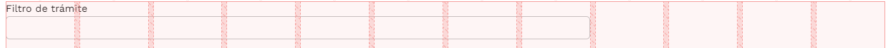
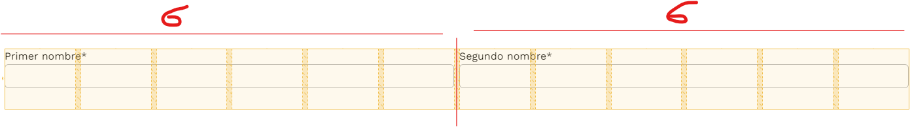
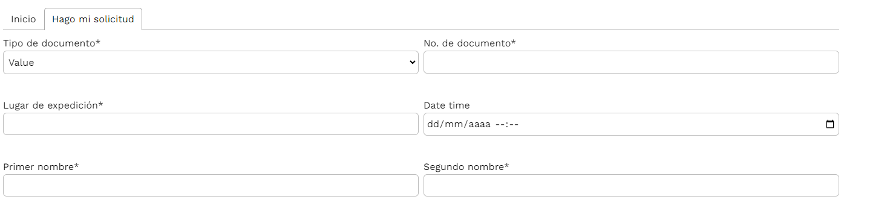
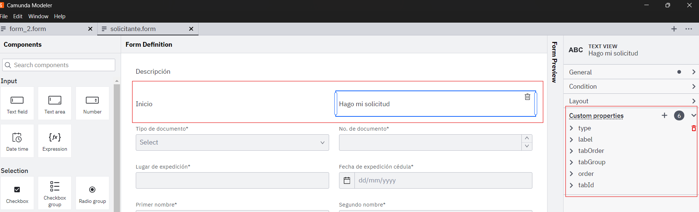
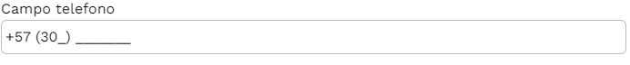
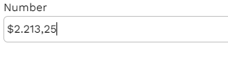

# Formularios Camunda

Elaboración de formularios usando la herramienta **Camunda Form 7**  y campos permitidos.

Formato básico de Camunda Form 7

```yaml
[
 {
         {
            "id": "Field_0o6xc0c",
            "label": "Filtro de trámite",
            "type": "textfield",
            "layout": {
              "columns": "8", // DE 12 COLUMNAS EL INPUT LLENA 8
              "row": "Row_0x8eer0",
            },
            "key": "fieldProcedure",
            "values": null,
            "validate": {
              "required": true, // CAMPO REQUERIDO
              "min": null,
              "max": null,
              "validationType": null,
              "minLength": null,
              "maxLength": null,
            },
            "timeLabel": null,
            "timeSerializingFormat": null,
            "timeInterval": null,
            "use24h": null,
            "fieldResponse": null,
            "properties": null,
            "defaultValue": null,
            "conditional": {
              "hide": "=true"
            },
            "description": null,
            "text": null,
            "customProperties": null,
          },
]
```

*Formulario de un solo input*

## Posicionamiento - layout

Para ubicar el input en un formulario los valores a tener en consideración son los siguientes:

```yaml
           "layout": {
              "columns": "8",
              "row": "Row_0x8eer0", 
            },
```

Donde columns hace referencia a las columnas que el input va a llenar:\n 

Y row, la fila donde estará ubicado el input. Si dos campos tienen la misma fila y cada uno tiene en el parámetro columns: "6", entonces los dos inputs estarían uno al lado del otro, teniendo el mismo tamaño.

**Para el modelador son 18 pero para el estandard de nuestro patron de renderizacion de formularios css solo permite 12 columnas.**

 

## Sobre los campos

Muchos de los campos no están soportados por **camunda form 7**, pero, los que si se les realizaron ciertas mejoras. Esto gracias a un campo llamado properties (hablando de la estructura) o customProperties en la herramienta de **camunda form 7**.

Estos campos tienen ciertos tipos. Siendo el parámetro "type" quien determina dicha naturaleza.

### Text

Este campo tiene un uso principal en la estructura del formulario, el cual es que sea un tab que agrupe ciertos campos o un grupo sencillo que envuelva varios campos de manera ordenada, de modo tal dichos inputs se mostrarían, solo si el tab está seleccionado.

ejemplo: 

```yaml
{
      "text": "Hago mi solicitud",
      "label": "Text view",
      "type": "text",
      "layout": {
        "row": "Row_1pd0nnx",
        "columns": null
      },
      "id": "Field_1v4cf23",
      "properties": {
        "type": "tab",
        "tabId": "tab_2-1"
      }
    },
```

 

Si se desea que los tabs estén uno al lado del otro es necesario seguir las siguientes reglas con respecto los parámetros properties y layout.

### properties

```yaml
      "properties": {
        "type": "tab", ---> debe ser de tipo "tab", así el sistema identifica su rol
      #  "label": "Hago mi solicitud", ---> La descripción de la tab (titulo)
      #  "tabOrder": "2", ---> posición de la tab, en este caso es el segundo tab
      #  "tabGroup": "tab-1", ---> indica a qué conjunto de tabs pertenece
      #  "order": "2", ---> este orden indica la prioridad del conjunto de tabs
        "tabId": "tab_2-1" ---> identificación de la tab, esta es la que se les coloca a los distintos inputs
      }
```

En otro caso, si lo deseado es realizar una agrupación simple (un conjunto de campos). La configuración en ese caso sería la siguiente:

```yaml
{
  "text": "Información básica del solicitante",
  "properties": {
    "type": "group", ---> debe ser de tipo "group", así el sistema identifica su rol
    "groupId": "basicInfo", ---> identificación del grupo, esta es la que se les coloca a los distintos inputs.
                                 Precisamente en su propiedad "group"
}
```

### layout

A diferencia de properties, este ya lo genera el propio **camunda form 7**, solo hay que tener en consideración que las filas deben ser las mismas, un ejemplo de este modelo sería el siguiente:

 Donde los campos de tipo text, Inicio y Hago mi solicitud están una misma fila. También en custom properties estaría los valores anteriormente expuestos.

## Campos del formulario

### TextField

Este es el campo principal, o más bien, el más común. Una estructura simple (siguiendo el ejemplo de los tabs) sería este:

```yaml
{
      "label": "Primer nombre*",
      "type": "textfield",
      "layout": {
        "row": "Row_0g2ijc7",
        "columns": 6
      },
      "id": "Field_11mwbyb",
      "key": "textfield_tsq68p",
      "properties": {
       # "tabGroup": "tab-1", ---> grupo que pertenece el tab
        "tabId": "tab_2-1" ---> tab al cual pertenece el campo
      }
    },
```

### Select

Campo que permite seleccionar varios campos, ya sea por una petición, o por opciones por defecto. 

ejemplo de campo seleccionar por petición:

```yaml
{
      values: [ ---> opciones por defecto
        {
          label: 'Value',
          value: 'value',
        },
      ],
      label: 'Departamento',
      type: 'select',
      layout: {
        row: 'Row_0e19dth',
        columns: 8,
      },
      id: 'Field_0je1kp9',
      key: 'fieldDepartment',
      properties: {
        urlEndpoint: 'https://nodejs.softwaretributario.com:8001/external/departments', --> API rest a la cual se enlistará las opciones
        keyPropEndpointData: 'Departamentos', ---> key dentro de la petición que contiene la lista de opciones
        httpMethod: 'post', ---> tipo de solicitud
      },
    },
```

También un campo seleccionar puede tener cono dependencia otros campos, y realizar peticiones con los valores de dichos campos, ejemplo:

ejemplo de campo municipio, que depende del campo "fieldDepartment".

```yaml
    {
      "values": [
        {
          "label": "Value",
          "value": "value"
        }
      ],
      "label": "Municipio",
      "type": "select",
      "layout": {
        "row": "Row_1t2238c",
        "columns": 6
      },
      "id": "Field_19nijmu",
      "key": "fieldCity",
      "validate": {
        "required": true
      },
      "properties": {
        "dependentFields": "[\"fieldDepartment\"]", --> campos del formulario camunda (key), los cuales depende este seleccionar
        "params": "[\"departmentId\"]", --> parámetro que necesita la petición para que pueda realizarse correctamente.
        "urlEndpoint": "https://nodejs.softwaretributario.com:8001/external/municipalities",
        "httpMethod": "post",
        "keyPropEndpointData": "Municipios"
      }
    },
```

> Nota: cada item de la lista "dependentFields" debe estar ordenada con respecto a la lista "params", esto debido a que en la petición se construirá un objeto teniendo en cuenta dicho orden, véase: {"departmentId": xx }, donde "xx" es el valor que tiene en ese momento el input "departmentId".

### Date

Campo para las fechas. Estructura:

```yaml
{
      "subtype": "date", ---> formato de las fechas
      "dateLabel": "Fecha de nacimiento*",
      "label": "Date time",
      "type": "datetime", ---> input de tipo date
      "layout": {
        "row": "Row_1tt90yu",
        "columns": null
      },
      "id": "Field_1qlzt95",
      "key": "datetime_shqou",
      "properties": {
       # "tabGroup": "tab-1",
        "tabId": "tab_2-1"
      }
    },
```

### File

Campo para subir archivos, este permite arrastrar y soltar archivos o el abrir el explorador

```yaml
    {
      label: 'Documento identidad',
      type: 'textfield',
      layout: {
        row: 'Row_1fdr6je',
        columns: null,
      },
      id: 'Field_18f51c8',
      key: 'textfield_ljmssb',
      properties: {
        inputType: 'file', ---> debe ser de tipo "file", así el sistema identifica su rol
    #    order: '4',
    #    tabGroup: 'tab-1',
        fileTypes: '["pdf"]', ---> que extensiones de los archivos son permitidas
        tabId: 'tab_2-1',
      },
      validate: {
        required: true,
      },
    },
```

### TextArea

Campo para el área de texto.

```yaml
{
      label: 'Perfil',
      type: 'textarea', ---> tipo de campo textarea
      layout: {
        row: 'Row_1v3vvzb',
        columns: null,
      },
      id: 'Field_065twpk',
      key: 'textfield_upz4ty',
      validate: {
        minLength: 5, ---> validaciones opcionales
        maxLength: 500, ---> validaciones opcionales
      }
    },
```

### Pattern

Campo de tipo pattern. Texfield que permite tener un formato, como por ejemplo uno telefónico:

```yaml
{
      label: 'Nuevo campo telefono',
      type: 'textfield',
      layout: {
        row: 'Row_193fkq2',
        columns: null,
      },
      id: 'Field_0vvwmlp',
      key: 'textfield_afbytv',
      properties: {
        inputType:'pattern', ---> campo de tipo "pattern" 
        format:"+57 (%%%) %%%%%%%", ---> formato que se mostrará en el input
        patternChar:"%", ---> ubicación del caracter dentro del patrón
        mask: '_', ---> carácter vacío en el patrón suministrado
        allowEmptyFormatting: true, ---> si desea que se muestre el patrón si no hay datos
    #    tabGroup: 'tab-1',
        tabId: 'tab_1-1',
      },
    },
```

 

Hay que tener en consideración que este campo es dependiente de una librería: <https://s-yadav.github.io/react-number-format/docs/props/>. En especifico ==Pattern format==

### Number

Campo tipo número, el cual se le puede asignar ciertas propiedades, para que pueda por ejemplo parecer un input de tipo "money".

```yaml
 {
      label: 'Number',
      type: 'number', --> tipo de campo numerico
      layout: {
        row: 'Row_0bzjaug',
        columns: null,
      },
      id: 'Field_07j8nl9',
      key: 'number_r9p7jc',
      properties: {
    #    order: '1',
        prefix: '$', --> prefijo que decora el campo
        decimalSeparator: ',', --> signo del separador decimal
        thousandSeparator: '.', --> signo del separador de miles
        decimalScale: 2, --> cantidad máxima de decimales permitidas
   #     "tabGroup": "tab-1",
        "tabId": "tab_2-1"
      },
    },
```

  

### Button

Componente que permite enviar el formulario y terminar el proceso.

```yaml
 {
   id: "Field_1mvr5io",
   label: "Enviar",
   type: "button",
   layout: {
        row: 'Row_0cw3uc1',
        columns: null,
      },
 }
```

# Preguntas…

### ¿Cómo podría agrupar campos?

En camunda from 7 debes tener un textView con las propiedades:

```yaml
{
  "type": "tab",
  "groupId": "basicInfo"
}
```

y en los campos que deseas que estén adentros colocar en sus propiedades:

```yaml
{
  "group": "basicInfo"
}
```

Y listo, ya tienes grupos.

### ¿Podría tener tabs y groups a la vez?

Si. Solo habría que tener en cuenta las propiedades en los campo text y también los respectivos inputs. O sea, tabGroup, tabId y group. A su vez que el text view del grupo de campos debe tener como parámetros "tabGroup" y "tabId".